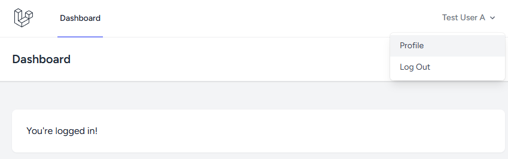
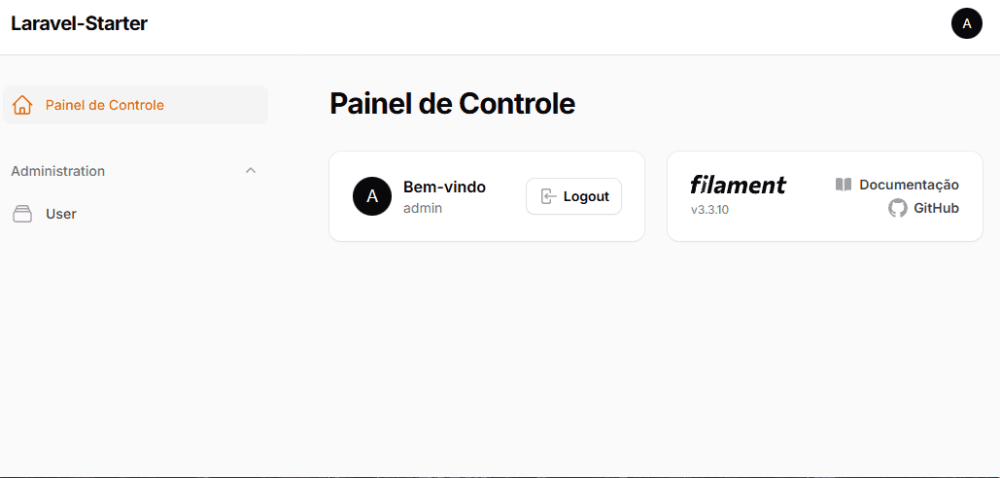

<p align="center"><a href="https://laravel.com" target="_blank"></a></p>

## Sobre o LFKS

Este projeto fornece uma base para desenvolver novas aplicações, que precisam rapidamente de autenticação e de painéis administrativos em conjunto de páginas autenticadas para usuários comuns. Os usuários administradores usam o sistema em diferentes contextos, acessando os painéis de usuários comuns e do administrativo com o mesmo login e sessão.

Os diferenciais são:

- :key: Ambientes diferentes de autenticação para usuários comuns e administradores, na mesma tabela de users e sem gerar novas rotas para o painel administrativo;
- :rocket: Utiliza o [Filament](https://filamentphp.com/) no painel admministrativo que acelera a criação de CRUDs com um único comando;
- :computer: Utiliza [Breeze](https://github.com/laravel/breeze) + [Tailwind](https://play.tailwindcss.com/) como exemplo em outras páginas básicas para usuários comuns, mas você pode trocar para outras opções como bootstrap, com pouco esforço.
- :speech_balloon: Localizado em sua maior parte para português como padrão;
- :moneybag: Licença que permite comercialização (e que não faça exigência de exposição de regras de negócio proprietárias, use a vontade).

Dashboard do usuário comum, segue na stack de autenticação padrão do Laravel:


Dashboard do painel administrativo, reutilizando a tabela de users <small>(a tabela user foi modificada para diferenciar os papéis)</small>:


Utilizando toda a infraestrutura do Laravel, este projeto pode ser útil para hackatons, MVPs e também para projetos maiores.

### Estrutura
- No diretório /routes consta o esquema padrão de rotas da aplicação para o usuário comum.
- A partir da rota /admin o roteamento fica com o Filament, constituindo todo o painel administrativo da aplicação.

## Como Usar

### Requisitos

- PHP >= 8.2;
- MySQL >= 8.0;
- Extensões do PHP ativas: openssl, pdo, mbstring, tokenizer, xml, ctype, json. 


### Instalação

```console
git clone https://github.com/fabiosperotto/laravel-starter
composer install 
```


Ao final da instalação, verifique as credenciais do banco de dados no .env e então execute:
```console
php artisan migrate
php artisan db:seed 
``` 
Serão criados dois usuários:
```console
# usuário comum
e-mail: test@example.com
senha: password

# usuário administrador
e-mail: admin@example.com
senha: password
``` 

A partir de agora a instalação está pronta, para rodar a aplicação, execute `php artisan serve`


## Aprendendo sobre a Stack

- [Documentação do Laravel](https://laravel.com/docs);
- Para quem não curte ler, tem o [Laracasts](https://laracasts.com) onde reúne vários videos de tutoriais de variados assuntos para com o Laravel.
- [Documentação do Filament](https://filamentphp.com/docs/3.x/panels/resources/getting-started);
- [Documentação e Playground do Tailwind CSS](https://play.tailwindcss.com)


## Licença

Este projeto é licenciado sobre a [licença MIT](https://opensource.org/licenses/MIT).


## Agradecimentos

Nada disso seria possível sem os esforços das comunidades que mantem todo o ecosistema Laravel e Filament. :blue_heart: